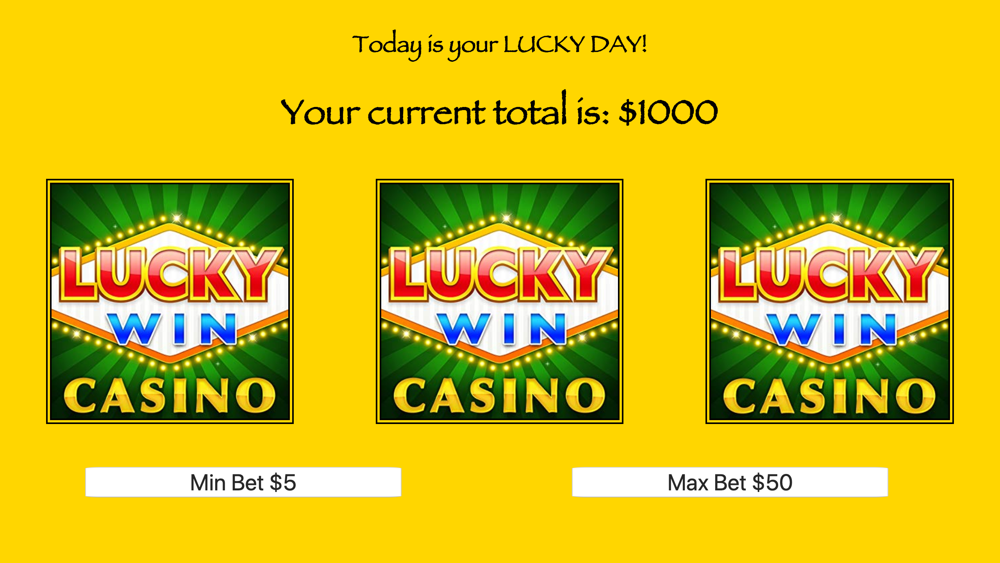

# 🎰 My Awesome Slot Machine

https://quizzical-fermi-f84648.netlify.com
### Goal: Build a Simple Slot Machine

### Tech used: HTML5, CSS3, Javascript
Here I built a fully function lottery machine. That actively responds to user input.  Users are able to choose between the min bet of $5 and a max bet of $50.  The user also starts with a money pot of $1000.  Once the user has chosen there bet and click on the button then the slot machine kicks of to see if they won or not

